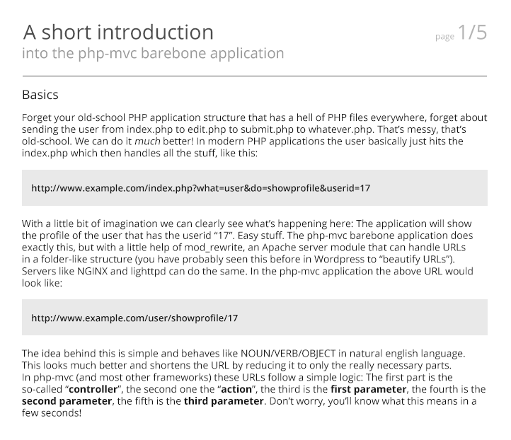
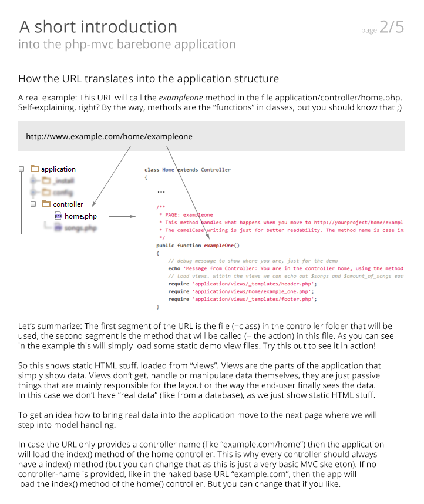
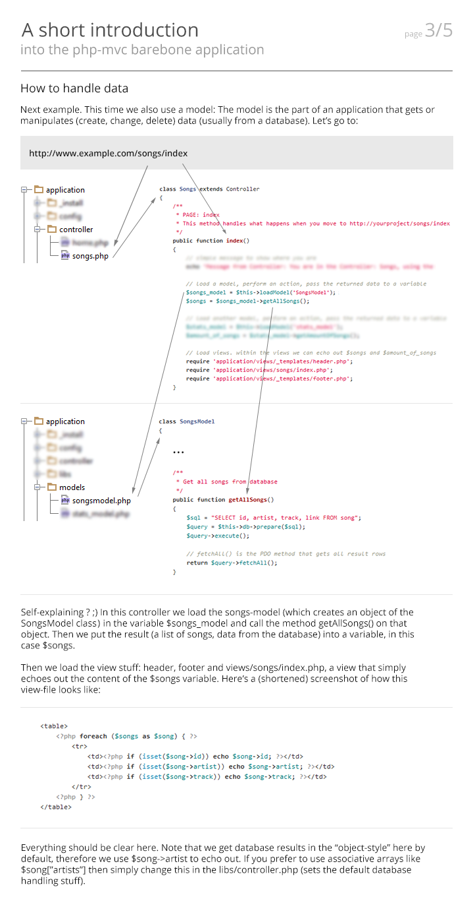
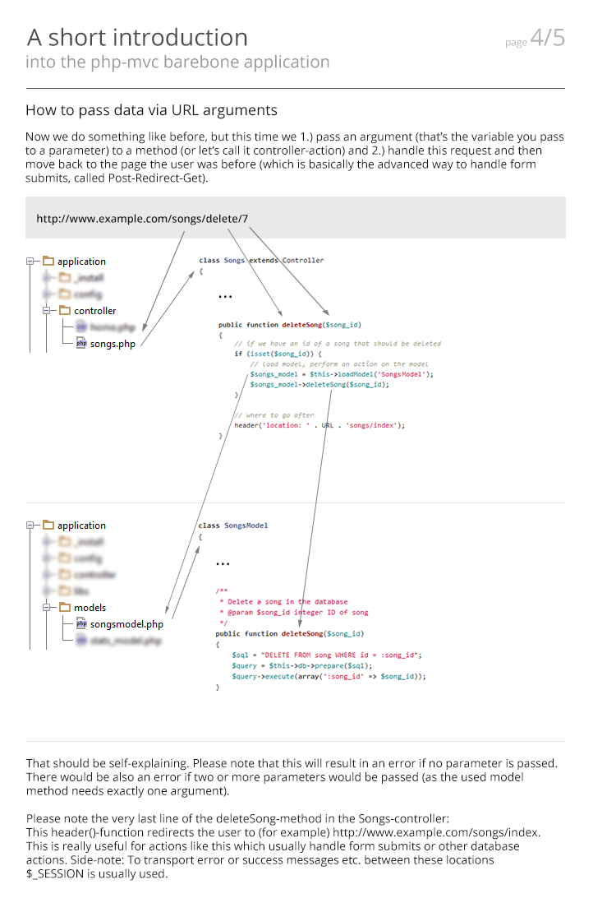
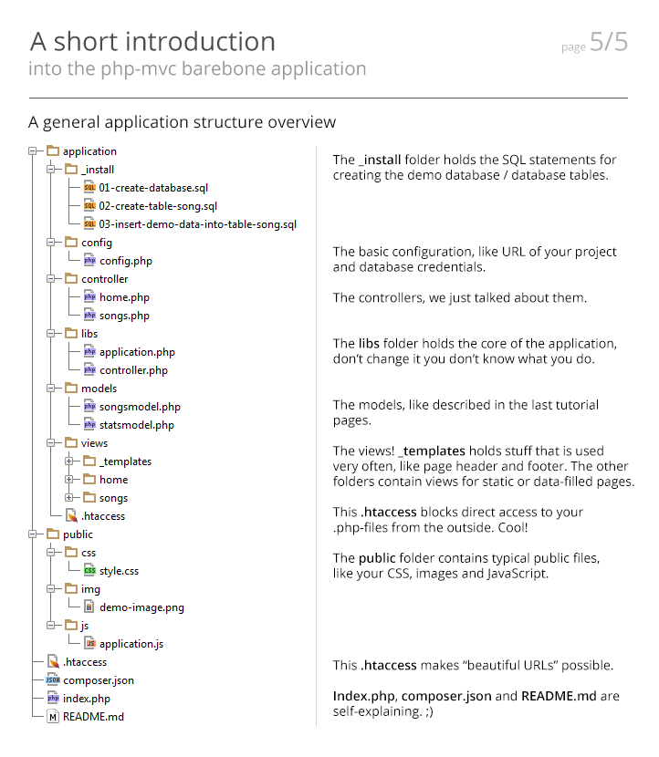

## Installation

### On Windows 7 (with EasyPHP)

There's a tutorial on [How to install php-mvc on Windows 7, 8 and 8.1](http://www.dev-metal.com/install-php-mvc-windows-7/).

### On Ubuntu etc.

First, copy this repo into a public accessible folder on your server.
Common techniques are a) downloading and extracting the .zip / .tgz by hand, b) cloning the repo with git (into var/www)

```
git clone https://github.com/panique/php-mvc.git /var/www
```

or c) getting the repo via Composer (here we copy into var/www)

```
composer create-project panique/php-mvc /var/www dev-master
```

1. Install mod_rewrite, for example by following this guideline:
[How to install mod_rewrite in Ubuntu](http://www.dev-metal.com/enable-mod_rewrite-ubuntu-12-04-lts/)

2. Run the SQL statements in the *application/_install* folder.

3. Change the .htaccess file from
```
RewriteBase /php-mvc/
```
to where you put this project, relative to the web root folder (usually /var/www). So when you put this project into
the web root, like directly in /var/www, then the line should look like or can be commented out:
```
RewriteBase /
```
If you have put the project into a sub-folder, then put the name of the sub-folder here:
```
RewriteBase /sub-folder/
```

4. Edit the *application/config/config.php*, change this line
```php
define('URL', 'http://127.0.0.1/php-mvc/');
```
to where your project is. Real domain, IP or 127.0.0.1 when developing locally. Make sure you put the sub-folder
in here (when installing in a sub-folder) too, also don't forget the trailing slash !

5. Edit the *application/config/config.php*, change these lines
```php
define('DB_TYPE', 'mysql');
define('DB_HOST', '127.0.0.1');
define('DB_NAME', 'php-mvc');
define('DB_USER', 'root');
define('DB_PASS', 'mysql');
```
to your database credentials. If you don't have an empty database, create one. Only change the type `mysql` if you
know what you are doing.

## A quickstart tutorial

You can also find these tutorial pictures in the *_tutorial* folder.







## You like what you see ?

Then please also have a look on ...


## Useful information

1. SQLite does not have a rowCount() method (!). Keep that in mind in case you use SQLite.

2. Don't use the same name for class and method, as this might trigger an (unintended) *__construct* of the class.
   This is really weird behaviour, but documented here: [php.net - Constructors and Destructors](http://php.net/manual/en/language.oop5.decon.php).


## License

This project is licensed under the MIT License.
This means you can use and modify it for free in private or commercial projects.

